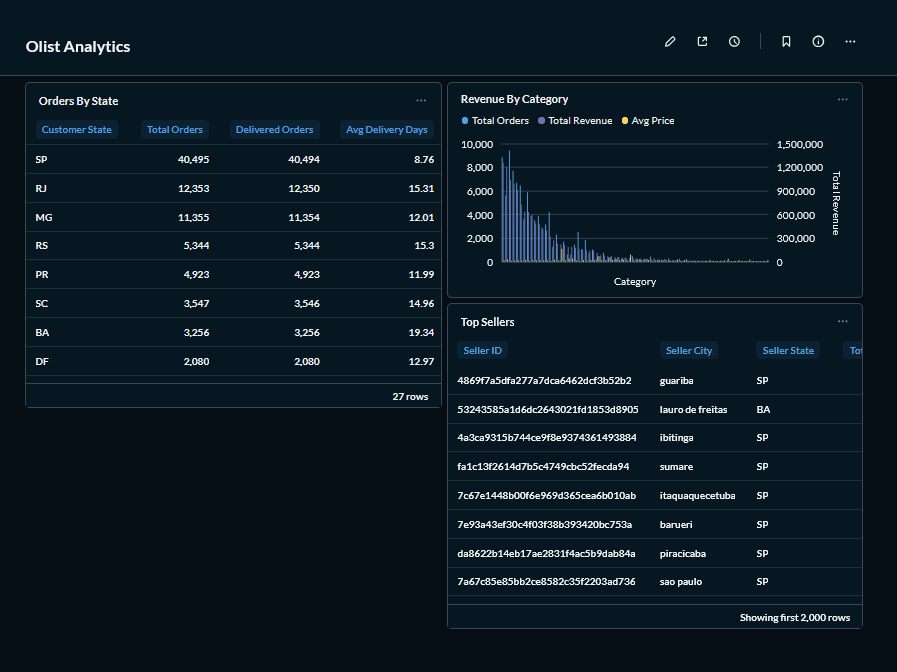

# Olist Data Pipeline 🚀

Um pipeline de engenharia de dados completo construído com dados reais de e-commerce brasileiro da [Olist](https://olist.com/).

---

## Arquitetura
CSV (Olist) → Ingestão Python → PostgreSQL (raw) → dbt (staging/marts) → Dashboard Metabase
↑
Prefect (orquestração)

---

## Stack

| Camada | Tecnologia |
|---|---|
| Fonte de dados | Dataset Olist (Kaggle) |
| Ingestão | Python + Pandas |
| Armazenamento | PostgreSQL 15 |
| Transformação | dbt |
| Orquestração | Prefect 2 |
| Visualização | Metabase |
| Infraestrutura | Docker Compose |

---

## Modelos dbt

### Staging
- `stg_orders` — dados de pedidos limpos
- `stg_customers` — dados de clientes limpos
- `stg_order_items` — dados de itens de pedido limpos

### Marts
- `orders_by_state` — total de pedidos e média de dias de entrega por estado
- `revenue_by_category` — receita e pedidos por categoria de produto
- `top_sellers` — melhores vendedores por receita

---

## Como rodar

### Pré-requisitos
- Docker Desktop
- Python 3.11

### 1. Clone o repositório
```bash
git clone https://github.com/thalisondev/olist-data-pipeline.git
cd olist-data-pipeline
```

### 2. Baixe o dataset
Baixe o [dataset da Olist](https://www.kaggle.com/datasets/olistbr/brazilian-ecommerce) e coloque os arquivos CSV em `data/raw/olist/`.

### 3. Suba a infraestrutura
```bash
docker-compose up -d
```

### 4. Rode a ingestão
```bash
python pipeline.py
```

### 5. Rode os modelos dbt
```bash
cd transform
dbt run --profiles-dir .
```

### 6. Acesse os dashboards
- **Metabase:** http://localhost:3000
- **Prefect:** http://localhost:4200

---

## Dashboard



---

## Dataset
- +100k pedidos de 2016 a 2018
- 9 tabelas: pedidos, clientes, produtos, vendedores, pagamentos, avaliações, geolocalização
- Fonte: [Kaggle - Brazilian E-Commerce Public Dataset by Olist](https://www.kaggle.com/datasets/olistbr/brazilian-ecommerce)

---

## Contato

LinkedIn: [linkedin.com/in/thalison-dev](https://www.linkedin.com/in/thalison-dev)